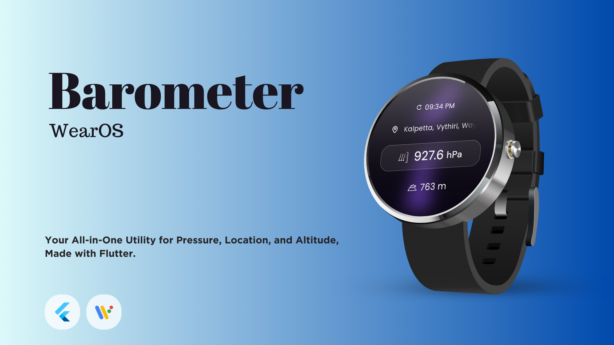
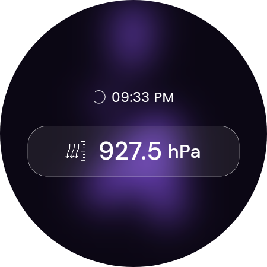
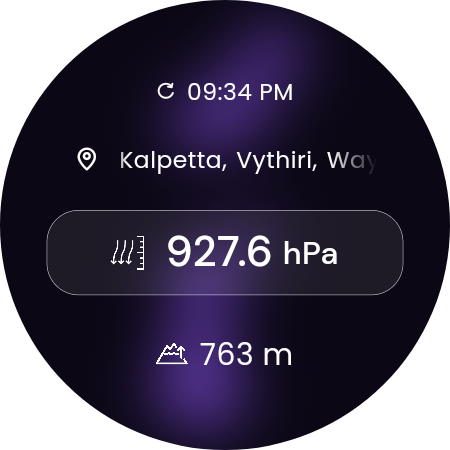

# Barometer WearOS

This Flutter app is designed for Wear OS devices to access and display Barometer values, Location data, and Altitude information. It utilizes Flutter's cross-platform capabilities to deliver sensor data directly to your wrist. This README provides an overview of the app's features.

**Note**: Before using this app, please ensure that your Wear OS device supports the necessary sensors and permissions.

⚠️ Please note that this version is in **beta** and may contain bugs.

## Features

- **Barometer Data**: Access real-time barometer readings.
- **Location Data**: Retrieve location information
- **Altitude Information**: Altitude based on location

**Note**: To enable geocoding functionality, please obtain an API key from the website https://locationiq.com/ and add it on appropriate dart file.

## Screenshots

 |  

Lava lamp Animation credit - https://github.com/RetroMusicPlayer/Paisa

