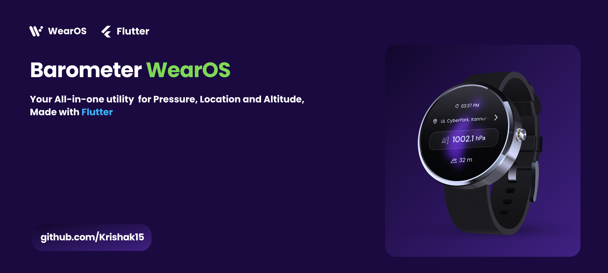
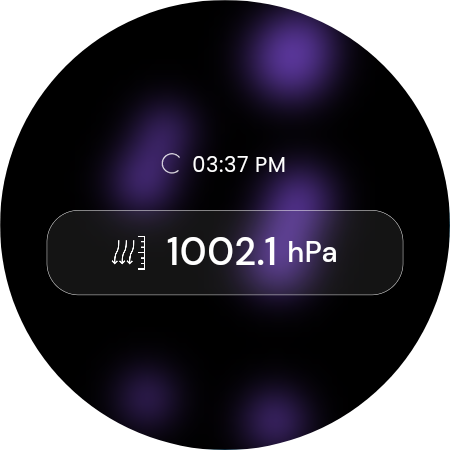
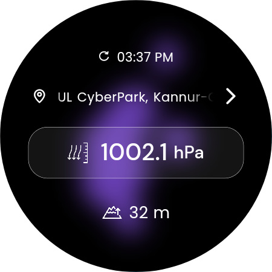
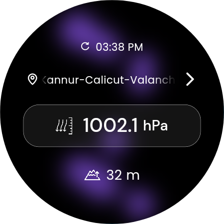
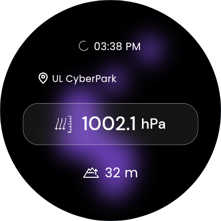
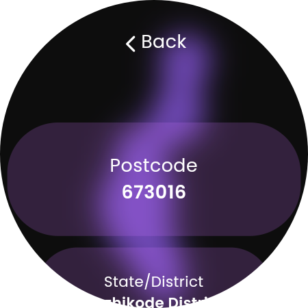
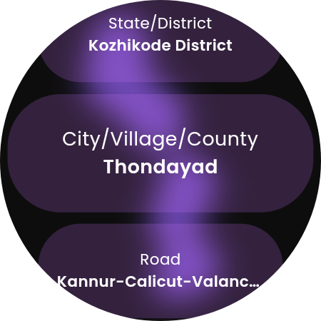

  &nbsp;  &nbsp; 

# Barometer WearOS

This Flutter app is designed for Wear OS devices to access and display Barometer values, Location data, and Altitude information. It utilizes Flutter's cross-platform capabilities to deliver sensor data directly to your wrist. This README provides an overview of the app's features.
&nbsp;
<div id="image-container">
  
</div>
&nbsp;
&nbsp;

**Note**: Before using this app, please ensure that your Wear OS device supports the necessary sensors and permissions.

⚠️ Please note that this version is in **beta** and may contain bugs.
&nbsp;
## Features

- **Barometer Data**: Access real-time barometer readings.
- **Location Data**: Retrieve location information
- **Altitude Information**: Altitude based on location

**Note**: To enable geocoding functionality, please obtain an API key from the website https://locationiq.com/ and add it on appropriate dart file.

## Screenshots

 &nbsp;   &nbsp;
 &nbsp;  
&nbsp;  &nbsp;  

## App on a Physical Device

<div id="image-container">
 &nbsp;   &nbsp;  </div>


## How to debug

1) Enable developer options on your WearOS device.
2) Enable USB Debugging and Wireless debugging.
3) Both PC and Watch should be on same Wi-Fi network.
4) Pair device using ```adb pair <IP of device>``` then enter pairing code when prompted for secure TCP/IP communication.
5) ```adb pair``` is used for wifi pairing your device with Android >= 11, while ```adb connect``` can be used to connect directly to a device with Android <11 over wifi.
6) Either you can debug directly or Build app using ```flutter build apk``` command and install the app using ```adb install <path to .apk file>``` **recommended**

## How to install

1) Do the same steps as above in **How to debug** section tiil **Step 5**.
2) Then copy downloaded file to PC and run command prompt in the same folder. 
3) Install the app using ```adb install <path to .apk file>``` (PC). You can also use your android phone to install app; use **GeminiMan** WearOS Manager app from playstore.
4) Enjoy the app.

   
   

  
&nbsp;
&nbsp;

Lava lamp Animation credit - https://github.com/RetroMusicPlayer/Paisa


